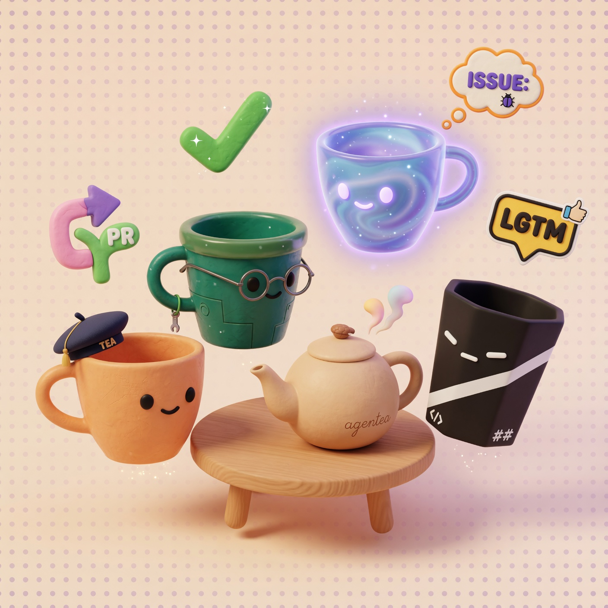

# 🫖 agentea

<p align="center">
  
</p>

<p align="center">
  <strong>Claude Code + Codex + Grok + Antigravity 가 함께 일하는 다중 에이전트 협업 스킬셋</strong>
</p>

<p align="center">
  <a href="https://github.com/thesun4sky/agentea/stargazers"></a>
  <a href="https://github.com/thesun4sky/agentea/blob/main/LICENSE"></a>
  <a href="https://claude.ai/claude-code"></a>
  <a href="https://cmux.com"></a>
</p>

<p align="center">
  <a href="#-quick-start">빠른 시작</a> •
  <a href="#-스킬-목록">스킬 목록</a> •
  <a href="#-사용법">사용법</a> •
  <a href="#-prerequisites">사전 요구사항</a> •
  <a href="#-아키텍처">아키텍처</a> •
  <a href="#-기여">기여</a>
</p>

---

4개의 AI 에이전트가 같은 cmux 워크스페이스에서 **함께** 코드 리뷰, 아이디에이션, 의사결정을 수행합니다. Claude Code가 오케스트레이터로 모든 수정을 담당하고, Codex · Grok · Antigravity가 독립 리뷰어로 참여합니다.

```
/agentea-review    →  Claude + Codex + Grok + agy 가 같은 diff를 병렬 리뷰
/agentea-council   →  4자 투표로 기술 결정 (합의 / 이견 자동 감지)
/agentea-ask       →  한 줄로 모든 에이전트에 broadcast
```

---

## 🚀 Quick Start

### Step 1 — 설치

**Option A: Claude Code 플러그인** (권장)

Claude Code 세션 안에서:
```
/plugin marketplace add https://github.com/thesun4sky/agentea
/plugin install agentea
```

**Option B: 원라이너**
```bash
curl -fsSL https://raw.githubusercontent.com/thesun4sky/agentea/main/install.sh | bash
```

> 업데이트: `cd ~/.claude/agentea-src && git pull`

---

### Step 2 — 사전 도구 설치

| 도구 | 설치 |
|------|------|
| [cmux](https://cmux.com) | macOS 앱 다운로드 |
| [Claude Code](https://claude.ai/claude-code) | `npm i -g @anthropic-ai/claude-code` |
| [Codex CLI](https://github.com/openai/codex) | `npm i -g @openai/codex` |
| [Grok CLI](https://x.ai/cli) | xAI 공식 CLI 페이지 참조 |
| [Antigravity CLI](https://antigravity.google/product/antigravity-cli) | `curl -fsSL https://antigravity.google/cli/install.sh \| bash` |
| [GitHub CLI](https://cli.github.com/) | `brew install gh && gh auth login` *(PR 리뷰 시 필요)* |

> ⚠️ 모든 에이전트는 **구독 계정 OAuth** 로그인 방식입니다 (API key 아님).

---

### Step 3 — 세션 시작

```
/agentea
```

→ 모드(auto/manual) + 에이전트(codex/grok/agy) 선택 → cmux pane 자동 생성 → 로그인 확인 → 완료

또는 인자로 직접 지정:
```
/agentea on auto codex grok agy
/agentea on manual codex
```

---

## ✨ 스킬 목록

| 명령 | 설명 |
|------|------|
| `/agentea` | 세션 시작 — 모드 + 에이전트 선택, pane 생성 |
| `/agentea-status` | 에이전트 상태 조회 (✅ready / ⏳busy / 🔐login / ❓unknown) |
| `/agentea-ask` | 메시지 전송 (기본: broadcast, 첫 토큰이 에이전트면 타겟 전송) |
| `/agentea-review` | **(1+N)자 LGTM** 코드 리뷰 루프 — 모두 LGTM이어야 종료 (최대 5라운드) |
| `/agentea-council` | 결정 안건 투표 — 합의 / 이견 자동 감지 (최대 3라운드) |
| `/agentea-brainstorming` | 아이디에이션 — 독립 응답 수집 + Claude 통합 요약 |
| `/agentea-clear` | `.agentea/` 산출물 + state 히스토리 초기화 (pane 유지) |
| `/agentea-off` | 모든 pane 종료 + 세션 비활성화 |

### 모드

| 모드 | 동작 |
|------|------|
| **auto** | Claude 작업 완료 후 description 키워드로 `/agentea-review`, `/agentea-council` 자동 트리거 |
| **manual** | 자동 트리거 없음 — 사용자가 직접 명시 호출 |

---

## 🎮 사용법

### 코드 리뷰

```bash
/agentea-review                   # 현재 git diff 리뷰
/agentea-review file src/auth.ts  # 특정 파일
/agentea-review pr 123            # PR 리뷰 (gh CLI 필요)
/agentea-review commit            # 최근 커밋
```

### 메시지 전송

```bash
/agentea-ask "이 설계 어떻게 생각해?"       # 전체 broadcast
/agentea-ask codex "이 함수 봐줘"           # codex만
/agentea-ask agy "리팩토링 의견 줘"         # antigravity만
```

### 의사결정 투표

```bash
/agentea-council "REST API vs GraphQL 중 어느 쪽이 나을까요?"
```

### 아이디에이션

```bash
/agentea-brainstorming "다크모드 토글 위치 후보"
```

### 정리 / 종료

```bash
/agentea-clear   # .agentea/ 산출물 정리
/agentea-off     # 모든 pane 닫고 세션 종료
```

---

## 📁 .agentea/ 폴더 구조

협업 산출물은 프로젝트 루트의 `.agentea/`에 저장되며, 자동으로 `.gitignore`에 추가됩니다.

```
.agentea/
  role_guide.md          # 에이전트 역할 안내 (ON 시 생성)
  review_r1.diff         # 리뷰 대상
  claude_r1.md           # Claude 응답
  codex_r1.md            # Codex 응답
  grok_r1.md             # Grok 응답
  antigravity_r1.md      # Antigravity 응답
  issues_r1.md           # 통합 이슈
  fixes_r1.md            # Claude 수정 내역
  council_1.md           # 안건
  codex_vote_1.md        # Codex 투표
  grok_vote_1.md         # Grok 투표
  antigravity_vote_1.md  # Antigravity 투표
  brainstorm_summary_1.md # Claude 통합 요약
```

---

## 🏗️ 아키텍처

```
agentea/
├── SKILL.md                    # /agentea 진입점
├── lib/
│   └── common.sh               # 공유 헬퍼 함수 (전 서브스킬이 source)
├── agentea-status/SKILL.md
├── agentea-ask/SKILL.md
├── agentea-review/SKILL.md
├── agentea-council/SKILL.md
├── agentea-brainstorming/SKILL.md
├── agentea-clear/SKILL.md
└── agentea-off/SKILL.md
```

설치 후 `~/.claude/skills/agentea/`에 symlink로 연결됩니다.  
상태 파일: `~/.claude/agentea-state.json` (v1 → v2 자동 마이그레이션)

### 설계 원칙

| | 원칙 |
|---|---|
| P1 | **Broadcast가 default** — 특정 에이전트 지정은 명시 옵션 |
| P2 | **단일 책임 원칙** — 8개 독립 SKILL.md + `lib/common.sh` 공유 |
| P3 | **단일 사용자/단일 세션 가정** — last-write-wins |
| P4 | **마이그레이션 호환** — 구 스키마 자동 변환 (백업 보존) |
| P5 | **State 게이팅** — `mode` + `interaction_mode` 두 축으로 제어 |

---

## 🔧 트러블슈팅

| 증상 | 해결 방법 |
|------|-----------|
| `ERROR: agentea lib/common.sh not found` | `ls ~/.claude/skills/agentea/lib/common.sh` 확인 후 재설치 |
| 에이전트 pane에 로그인 화면 | 해당 pane에서 직접 로그인 후 `/agentea` 재실행 |
| `_wait_file` 타임아웃 | `/agentea-status`로 상태 확인, 에이전트 pane 직접 점검 |
| `cmux: command not found` | [cmux.com](https://cmux.com)에서 macOS 앱 설치 |
| `/agentea-review pr 123` 실패 | `brew install gh && gh auth login` 실행 |

---

## 🤝 기여

PR / 이슈 환영합니다!

- 새로운 에이전트 지원 (Cursor, Continue, Aider, …)
- tmux / zellij / Windows Terminal 지원 (현재 cmux only)
- 자동화된 통합 테스트 (현재 수동 검증)

### 새 서브스킬 추가하기

```bash
# 1) 디렉토리 생성
mkdir agentea-mynewskill

# 2) SKILL.md 작성 (agentea-ask/SKILL.md 참조)
# 3) common.sh source + _require_on 가드 추가
# 4) install.sh에 'mynewskill' 추가
# 5) 이 README 스킬 목록에 신규 행 추가
```

---

## 📄 라이선스

MIT License

---

<p align="center"><em>🫖 "코드리뷰는 혼자 하는 것보다 넷이 하는 게 낫습니다"</em></p>
